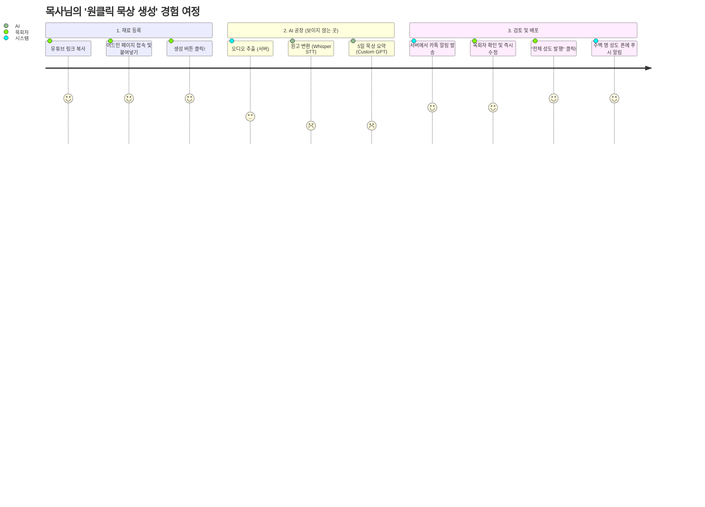

# 말씀브릿지(WordBridge): 무인 자동화 파이프라인 청사진 (Blue Print)

이 문서는 "목사님이 유튜브 링크 하나만 복사해 넣으면, 성도들에게 5일치 묵상이 배달되는 마법"을 어떻게 기술적으로 구현하는지 단계별로 쉽게 풀어낸 **마스터플랜**입니다. 

개발자, 기획자 혹은 투자자 등 누가 보더라도 이 시스템의 강력함과 자동화 흐름을 한눈에 이해할 수 있도록 설계했습니다.

---

## 1. 전체 아키텍처 조감도 (Overview)

이 시스템의 가장 큰 특징은 **"완전 관리형 무인 공장"**처럼 돌아간다는 것입니다. 사용자는 재료(유튜브 링크)만 넣으면 나머지는 AI와 자동화 서버가 다 알아서 처리합니다.

---

## 2. 4단계 자동화 파이프라인 심층 분석

### 🟢 STEP 1: 입력 (Input) - "재료 던져 넣기"
* **어디서?**: 앱 내 숨겨진 `관리자 모드(Admin)` 화면 또는 웹 페이지
* **누가?**: 담임목사님 또는 교회 행정 간사
* **무엇을?**: 해당 주일의 유튜브 영상 URL(예: `https://youtu.be/abcd...`) 또는 한글 파일로 된 원고 텍스트를 통째로 붙여넣습니다.

### 🟡 STEP 2: 추출 및 변환 (Processing) - "보이지 않는 공장"
*버튼을 누르는 순간 서버(백엔드)에서 일어나는 일들입니다.*

1. **오디오 분리 (yt-dlp)**: 유튜브 영상은 용량이 크므로, 영상은 버리고 가벼운 음성 파일(mp3)만 쏙 빼옵니다.
2. **원고화 대번역 (Whisper API)**: 추출된 30분짜리 목소리 파일을 OpenAI의 Whisper 엔진에 넣습니다. "은혜받읍시다" 같은 사투리나 빠른 말도 놀라울 만큼 정확하게 텍스트(대본)로 바꿉니다. (비용: 약 100원-200원 내외/건)
    * *※ 만약 STEP 1에서 원고 텍스트를 바로 넣었다면 이 1, 2번 과정은 생략되고 바로 3번으로 점프(터보 모드)합니다!*

### 🟠 STEP 3: 맞춤형 묵상 생성 (AI Generation) - "천재적인 조교"
* 이제 수만 자의 길고 다듬어지지 않은 원고를 **"파인튜닝된(우리가 가르친) 목회자 맞춤형 GPT"**에게 전달합니다.
* **마법의 프롬프트(명령어)**가 백그라운드에서 같이 전송됩니다:
  > *"이 원고를 읽고, 우리 교회의 평소 스타일대로 [제목], [본문 요약], 그리고 성도들이 월/화/수/목/금 5일 동안 하루 5분씩 깊이 묵상하고 삶에 적용할 수 있도록 다정하게 나누어 써 줘. 데이터는 JSON 형태로 뱉어내."*
* 단 10~20초 만에 완벽한 5일치 묵상 텍스트가 완성되어 데이터베이스(Firebase)에 '임시저장' 됩니다.

### 🔴 STEP 4: 최종 컨펌 및 배포 (Publish) - "터치 한 번으로 양떼 먹이기"
1. 요약이 끝나면 목사님 스마트폰으로 "묵상이 준비되었습니다!" 알림이 갑니다.
2. 목사님은 임시저장된 화면을 보면서 AI가 혹시나 (1% 확률로) 이상하게 쓴 말이 없는지, 교리적으로 틀린 건 없는지 쓱 훑어봅니다. 오타가 있으면 바로 그 화면에서 수정합니다.
3. 만족스럽다면 **`[성도 전체에게 발행하기]`** 버튼을 누릅니다.
4. 그 순간, **Firebase Cloud Messaging (FCM)**이 가동되면서 그 교회를 구독하고 있는 수백/수천 명의 성도 휴대폰으로 동시에 **"오늘의 묵상이 도착했습니다! 🙏"**라는 푸시(Push) 알림이 울립니다.

---

## 3. 구현을 위한 필수 기술 스택 (Tech Stack)

이 시스템을 구축하기 위해 아주 복잡하고 비싼 장비들이 필요하지 않습니다. 현대 스타트업들이 쓰는 가볍고 강력한 도구들을 조립만 하면 됩니다.

| 역할 | 필요 도구 및 서비스 | 비용(예상) |
| :--- | :--- | :--- |
| **관리자 화면 (프론트)** | Flutter (앱 내 숨김 메뉴) 앱 또는 단순한 React 기반의 웹 관리자 페이지 | (자체 개발) |
| **백엔드 서버 (뼈대)** | Firebase Cloud Functions (서버리스) 또는 Python(FastAPI) 기반의 가벼운 클라우드 서버 | 거의 무료 (무료 티어 넉넉함) |
| **유튜브 음원 추출** | `yt-dlp` (파이썬 오픈소스 라이브러리) | 무료 |
| **음성 ➔ 텍스트** | OpenAI **Whisper API** | 분당 $0.006 (건당 약 1~200원) |
| **텍스트 ➔ 5일 묵상** | 파인튜닝된 **GPT-4o mini API** | 건당 약 10원~50원 미만 (극강의 가성비) |
| **데이터베이스 저장** | Firebase Firestore | 초기 수천 명까지 사실상 무료 |
| **푸시 알림 발송** | Firebase Cloud Messaging (FCM) | 100% 무료 |

> 💡 **한 줄 요약:** 목사님이 설교 1편을 올릴 때 드는 시스템 원가 비(API 비용)는 **300원을 넘지 않습니다.**

---

## 4. 왜 이 시스템(Blue Print)이 혁명적인가?

1. **시간 절약 99%:** 기존에는 담임목사님이 설교 준비하고, 부목사님이 그걸 다시 듣고 텍스트로 치고, 요약해서 주보에 넣거나 밴드(Band)에 올리려면 짧아도 2~3시간이 걸렸습니다. 이제는 **설교 끝난 직후 복사-붙여넣기 1번으로 1분 안에 끝납니다.** 
2. **완벽한 SaaS형 B2B 비즈니스 모델:** 기술을 잘 모르는 부교역자, 행정 직원, 심지어 노년의 목사님도 아주 쉽게 쓸 수 있는 직관적인 "플랫폼" 상품(SaaS)이 됩니다. 
3. **가두리 양식장(Lock-in):** 이 압도적인 편리함과, AI가 뱉어내는 퀄리티 높은 요약본의 맛을 본 교회는 **절대로 예전의 수작업 시절로 돌아가지 못합니다.** 매월 교인당 구독료(ex: 300원)를 군말 없이 지불하게 되는 강력한 캐시카우 가 구축됩니다.

---
**[마무리]**
말씀브릿지는 단순한 일방향 '보는 앱'이 아니라, **"목회자의 지식"을 "성도의 실천"으로 5초 만에 변환해 주는 공장(Factory)**입니다. 이 청사진대로 개발 로드맵을 잡고 하나씩 조립해 나가면 완벽한 서비스가 될 것입니다!
